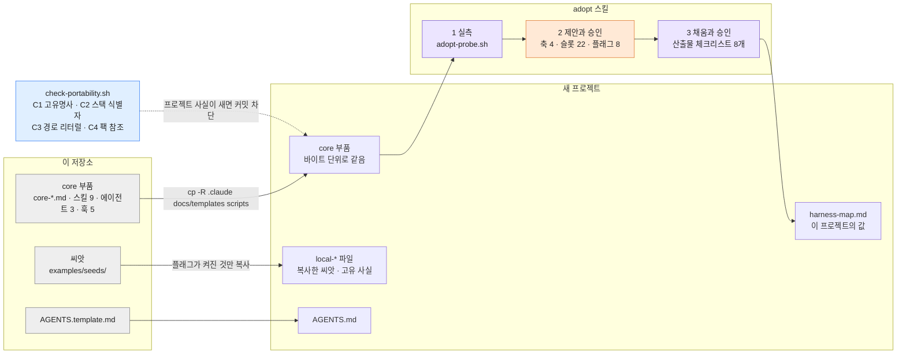
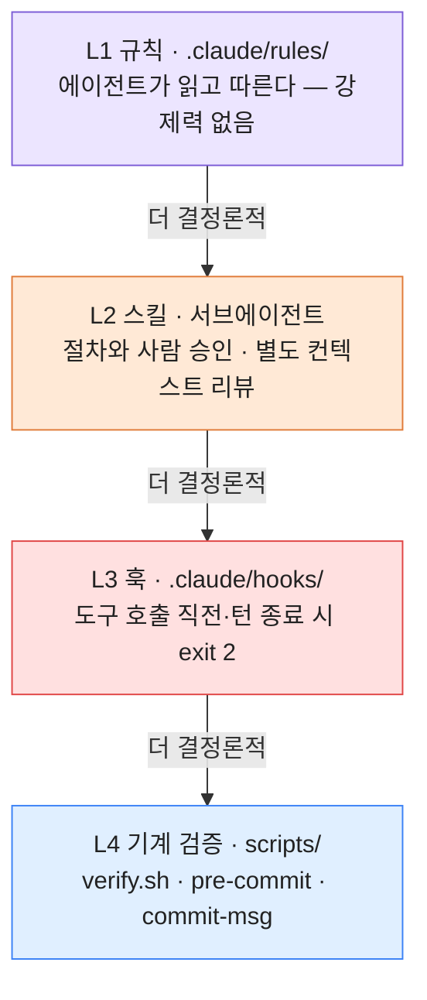

# 하네스 다이어그램

Superchaeyeons 하네스를 그림 세 장으로 설명한다. 요청 하나가 게이트와 훅을 지나는 길, 템플릿이 새 프로젝트에 붙는 방식, 강제력의 층이다. 코드는 Mermaid라서 GitHub에서 바로 렌더링되고, FigJam의 Mermaid 가져오기에 그대로 붙여 넣을 수 있다.

그림은 [`.claude/rules/README.md`](../../.claude/rules/README.md)(구성 요소 목록)와 [`component-map.md`](component-map.md)(실행 시점)를 옮긴 것이다. 두 문서와 어긋나면 그쪽이 맞고, 이 문서를 고친다.

## 색의 의미

세 그림이 같은 색 체계를 쓴다. FigJam에서 손으로 다듬을 때도 이 표를 따른다.

| 색 | 뜻 | 예 |
|----|----|-----|
| 회색 | 시작점·입력 | 세션 시작, 사용자 요청 |
| 보라 | 에이전트가 판단하는 곳 (규칙·스킬) | 트랙 판정, `specify` |
| 주황 | 사람이 승인하는 곳 | G2 승인, 커밋 승인 |
| 파랑 | 기계 검증 | `preflight`, `verify.sh` |
| 빨강 | 훅·검사기가 막는 곳 | exit 2 차단, 되돌림 |
| 초록 | 통과 | 커밋 |

## 요청 하나가 지나가는 길

사용자 메시지 하나가 처리되는 동안 무엇이 어느 순서로 끼어드는지 보여 준다. 트랙은 넷 중 하나만 고르고, 게이트 넷은 어느 트랙이든 전부 지난다. 사람이 끊는 곳(주황)과 기계가 끊는 곳(빨강)이 갈리는 것이 이 그림의 요점이다.

```mermaid
flowchart LR
    S["세션 시작<br/>always-load 규칙 8개<br/>warn-unfilled-map.sh"] --> U["사용자 요청"]
    U --> Q["ask-open-request.sh<br/>열린 표현이면 ask 알림"]
    Q --> T{"트랙 판정"}
    T -->|"A 기능·API·DB"| A["specify"]
    T -->|"B 감사·리팩터"| B["safe-refactor"]
    T -->|"C 버그"| C["debug"]
    T -->|"D 하네스 이식"| D["adopt"]
    A --> G1["G1 리서치<br/>researcher"]
    B --> G1
    C --> G1
    D --> G1
    G1 --> G2["G2 승인<br/>스펙·감사 항목·원인 가설·슬롯 제안"]
    G2 -->|"다른 이슈로"| DF["defer<br/>Draft 스펙·이슈"]
    G2 -->|"승인"| PF["preflight 사전 모드"]
    PF --> IM["구현"]
    IM --> PT{"PreToolUse 훅<br/>deny-dangerous-bash<br/>deny-out-of-scope-write"}
    PT -->|"위험 명령·범위 밖 쓰기"| BL["차단 exit 2"]
    PT -->|"통과"| G3["G3 검증<br/>preflight 사후 · doc-reviewer"]
    G3 --> ST{"Stop 훅<br/>deny-unverified-completion"}
    ST -->|"verify.sh 없이 완료 단정"| RB["되돌림 exit 2"]
    RB --> G3
    ST -->|"통과"| G4["G4 회고<br/>retro · report.md · 커밋 분할안"]
    G4 --> CA["커밋 승인"]
    CA --> GH{"git 훅<br/>pre-commit · commit-msg"}
    GH -->|"검사기 실패·형식 위반"| CB["커밋 차단"]
    GH -->|"통과"| OK["커밋"]

    classDef start fill:#eeeeee,stroke:#888888,color:#222222
    classDef ai fill:#ece5ff,stroke:#7c5cd6,color:#222222
    classDef human fill:#ffe9d6,stroke:#e07b39,color:#222222
    classDef verify fill:#e0efff,stroke:#3b82f6,color:#222222
    classDef block fill:#ffe0e0,stroke:#e04545,color:#222222
    classDef pass fill:#e2f7e6,stroke:#2f9e5a,color:#222222
    class S,U start
    class Q,T,A,B,C,D,G1,IM,DF,G4 ai
    class G2,CA human
    class PF,G3,PT,ST,GH verify
    class BL,RB,CB block
    class OK pass
```

그림은 단순화했다. `PreToolUse` 훅은 구현 단계뿐 아니라 **모든 도구 호출** 직전에 돈다. `Stop` 훅은 한 번만 되돌린다(`stop_hook_active`) — 무한 루프를 막기 위해서다. 커밋 승인은 사람이 하고, 에이전트는 분할안을 제안하는 데서 멈춘다.

## 템플릿이 새 프로젝트에 붙는 방식

이 저장소가 "템플릿"인 이유를 보여 준다. 규칙 본문(core)은 경로를 `{{슬롯}}`으로만 부르고, 프로젝트마다 다른 값은 `harness-map.md` 한 파일에 모인다. 그래서 새 프로젝트에 붙일 때 core 파일을 한 줄도 고치지 않는다.

수정 권한은 층마다 다르다. core는 고치지 않는다(검사기가 막는다). map은 `adopt`이 채운다. local은 자유롭게 고친다. 검사기는 파일명 접두사 `local-`로 이 층을 알아보고 검사에서 뺀다.

## 강제력의 층

하네스 장치를 강제력 순으로 쌓은 그림이다. 전부 강하게 만들지 않은 것이 설계다 — 판단이 필요한 것은 위층에, 되돌리기 비싸고 판정 가능한 것만 아래층에 둔다. 판단을 아래층에 넣으면 오탐으로 막히고, 막히는 장치는 곧 우회된다.

강제력이 가장 약한 게이트는 G1(조사를 했는가)과 G4(배운 것을 남겼는가)다. 둘 다 exit code로 판정할 수 없어 L1·L2에만 기댄다. 레이어별 설명은 [`README.md`](README.md)에 있다.

## 관련 문서

- [`README.md`](README.md) — 레이어와 사이클의 관계, 지금 동작 요약
- [`component-map.md`](component-map.md) — 구성 요소별 실행 시점·질문·검사
- [`../workflow-cycle.md`](../workflow-cycle.md) — 첫 번째 그림을 10단계로 따라가는 입문 문서
